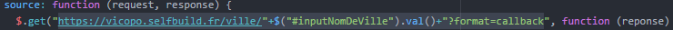
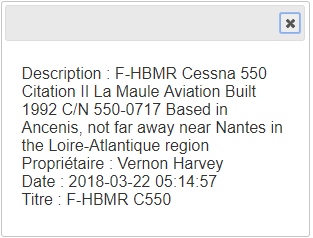
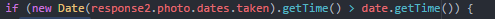

08/04/2018								Groupe 3

Mini-Projet 

Flickr

Théo Viardin et Quentin Ganacheau

Sommaire

•Présentation de l’architecture de l’API, autocomplétion…….p.1

•Vue photo…………………………………………………………………………………………..p.2

•Vue table…………………………………………………………………………………………….p.3

•Les limites, les difficultés rencontrées et améliorations possibles……………………………………………………………………………………………..p.4

Présentation de l’architecture de l’API, autocomplétion

Notre application comporte 3 fichier : Une page HTML, une feuille de style CSS ainsi que le fichier javascript permettant de réaliser les différentes fonctionnalités de notre application. La capture nous donne un aperçu visuel de la page lorsque l’on arrive sur l’application :

Nous avons mis en place deux onglets, onglet vue photo et vue table. Ces onglets permettent d’afficher les images de deux manières différentes.

Pour réaliser ces onglets, nous avons utilisés jQuery UI avec la fonction tabs() qui va permettre de transformer deux "div" HTML en deux onglets distincts.

L’autocomplétion fonctionne grâce à jQuery UI Autocompletion. La source donnée en paramètre est une fonction anonyme qui fait une requête sur l’URL mise à disposition par un API que nous avons trouvé sur internet qui renvoie qui ville correspondant à la ville passé en paramètre(https://vicopo.selfbuild.fr/ville/<NomDeLaVille>?format=callback).

La requête sur cette URL renvoie les 10 villes ressemblant le plus au string envoyé, qui sont ensuite formatées sous forme d’une tableau d’objet tels que :

{label:ville, value:ville}

Vue photo

Le but de la vue photo est simple, elle doit permettre d’afficher les images les unes en dessous des autres sans autres informations. Lors du clique sur une image des informations sur celle-ci doivent s’afficher dans une fenêtre modale.

En fonction de la ville entrée par l’utilisateur, une requête est réalisée sur l’API Flickr afin d’obtenir les images correspond à cette ville. Cette requête est réalisée de la façon suivante :

[http://api.flickr.com/services/rest/?method=flickr.photos.search&](http://api.flickr.com/services/rest/?method=flickr.photos.search&)

* api_key : clé API unique

* text : ville entrée

* format = json : pour recevoir du JSON en retour

* nojsoncallback=? : ce qui permet de formater la réponse en JSON

* per_page : nombre de photo demandée

La fenêtre modale est créée grâce à jQuery UI avec la fonction .dialog().

Ce modale est remplit grâce à la requête sur l’API Flickr, on va chercher les informations de l’image grâce à une requête avec Ajax et on remplit ensuite le modale. Ce modale ne s’affiche donc qu’au clique sur une image. Si une image ne possède pas de description, un message le spécifie. Si aucune image n’est trouvé pour la ville choisie par l’utilisateur alors un modale le spécifie. Enfin lorsqu’un modale est déjà affiché et que l’utilisateur clique sur une nouvelle image alors l’ancien modale est fermé et un nouveau est ouvert.

Résultat :

Vue table

La vue table quant à elle a pour but d’afficher dans une table avec plusieurs colonnes contenant l’image et des informations la concernant. Pour réaliser la table nous avons utilisés le plugin jQuery DataTable. En fonction de la ville choisie par l’utilisateur et du nombre d’image choisi on réalise une requête sur l’API Flickr. Avec le résultat de la requête, on remplit un table contenue dans le HTML sur laquelle, par la suite, nous appliquons la plugin DataTable.

Pour récupérer toutes les informations nécessaires pour remplir toutes les colonnes du tableau (titre, description, propriétaire, date) on fait une autre requête pour chaque image telle que :

[http://api.flickr.com/services/rest/?method=flickr.photos.getInfo&](http://api.flickr.com/services/rest/?method=flickr.photos.getInfo&)

* api_key : clé API unique

* photo_id: id unique de la photo contenu dans la réponse à la précédente requête

* format = json : pour recevoir du JSON en retour

* nojsoncallback=? : ce qui permet de formater la réponse en JSON

Résultat pour 4 photos :

On peut voir que l’on affiche que les données disponibles. Les images sont affichées sont forme de vignettes. Lors d’une clique sur une image, celle-ci s’ouvre en taille réelle dans un jQuery UI Dialog:

Affichage de photos en fonction de la date

Si l’input de type date n’est pas vide, le programme va s'exécuter de la même manière mais au moment où il aurait dû afficher l’image (dans l’onglet 1 comme dans l’onglet 2), il va d’abord vérifier que la date de la photo est supérieur à la date sélectionnée grâce à l’objet Date() de JavaScript. On utilise la fonction getTime() qui renvoie la date sous forme de milliseconde ce qui nous permet de les comparer.

Les limites, les difficultés rencontrées et améliorations possibles

**Les limites et difficultés : **

* Un des problèmes de notre programme est que lors de l’affichage des photos en fonction d’une date, le nombre de photo demandé n’est plus respecté car le programme va bien demandé le bon nombre de photos mais il va afficher seulement celles qui respectent la date demandée.

**Améliorations possibles :**

-Dans notre application, il n’est possible de faire des recherches qu’en fonction des villes. Il aurait été intéressant de pouvoir mettre en place de plus nombreux critères de recherche.

